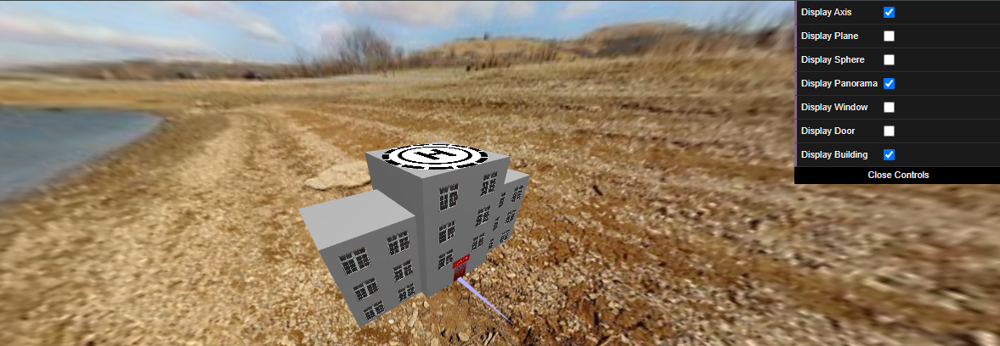

# CG 2024/2025

## Group T11G09

## Project Notes

Figure 1&2: MyPanorama 

Figure 3: Mybuilding 

Figure 4: MyForest 

Figure 5: MyHeli 

Figure 6: MyHeli Moving 

Figure 7: MyFire & MyWater 

Figure 8: MyFire with shaders 

## Extras

- Heli Camera. (F to activate and C to default)

- Heli Sound.

- Pulsating Lights.

- Heliport 'blinking' between 'up' and 'down' when performing manoeuvres.

- Cloud effect at panorama

Figure 9: Heli Camera 

Figure 10: Pulsating Lights and Heliport Alternating 

Figure 11: Cloud effect
