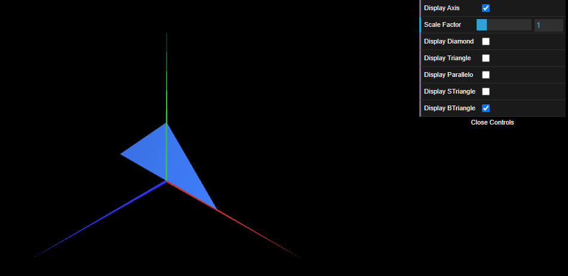

# CG 2024/2025

## Group T11G09

## TP 1 Notes

- In exercise 1, with the **MyDiamond.js** we learned how to create **MyTriangle.js**, and with that we were able to create the **MyParallelogram.js** with 4 triangles. To make the double-sided effect we repeat two times the same indexes, but in the second time we change first with third index and vice versa.

- In exercise 2, as we already had the **MyTriangle.js**, it was easy to create **MyTriangleSmall** and **MyTriangleBig**.

Figure 2: Small Triangle

Figure 1: Big Triangle

