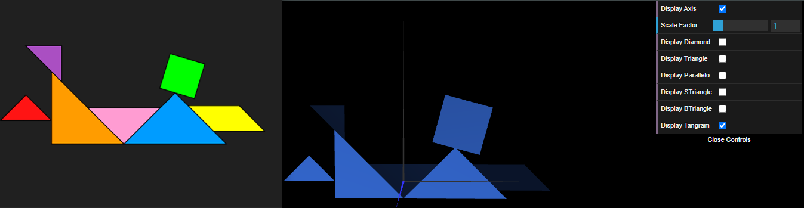
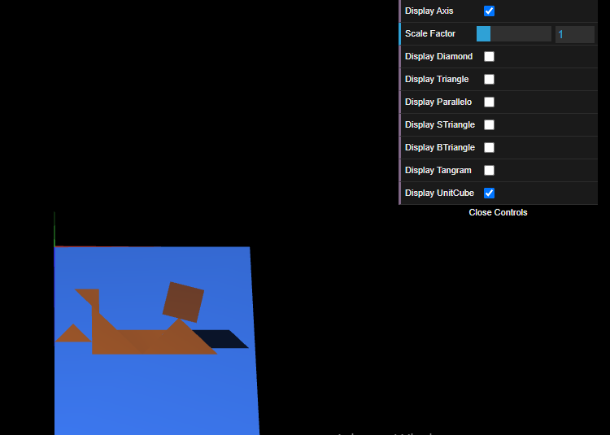
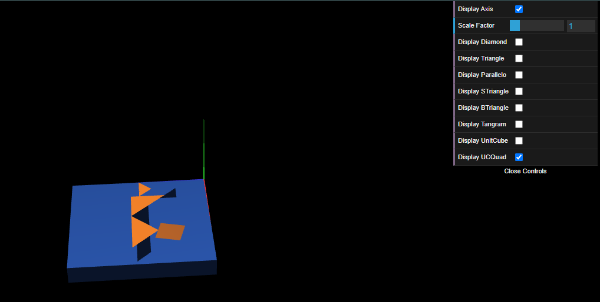

# CG 2024/2025

## Group T11G09

## TP 2 Notes

- In Exercise 1 we built a randomly given tangram figure using the previously created figures, our biggest difficulty was to start understanding how the transformations worked, once we learnt how to do all the geometric transformations it was easy.

Figure 1: Tangram

- In Exercise 2 we built a unit cube centered on the origin and applied some geometric transformations to it, such as rotation and translation.Then we combined the tangram created in Exercise 1, using the same transformations.

Figure 2: Unit Cube

- In exercise 3 we started by building a basic square centred on (0,0,0), then created MyUnitCubeQuad.js with 6 views of the Myquad instance and some transformations to make a cube. We noticed that it was easier to build the unit cube with 6 squares than with just triangles as in exercise 2.

Figure 3: Unit Cube Quad

