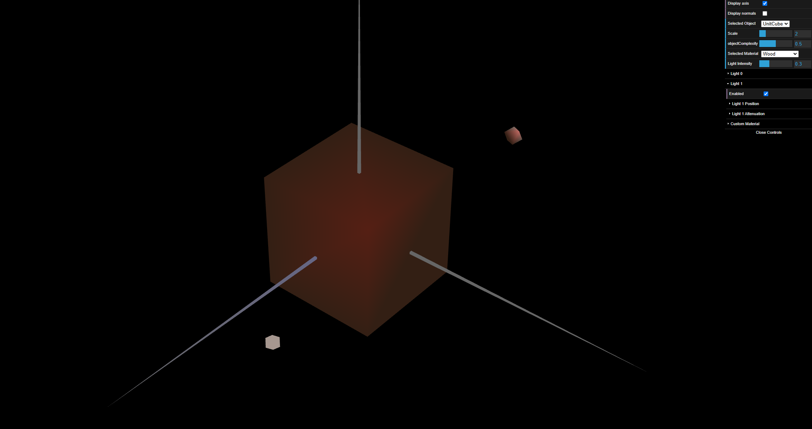
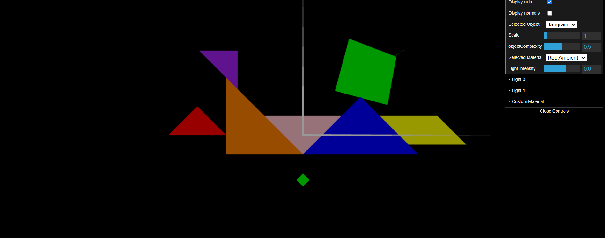
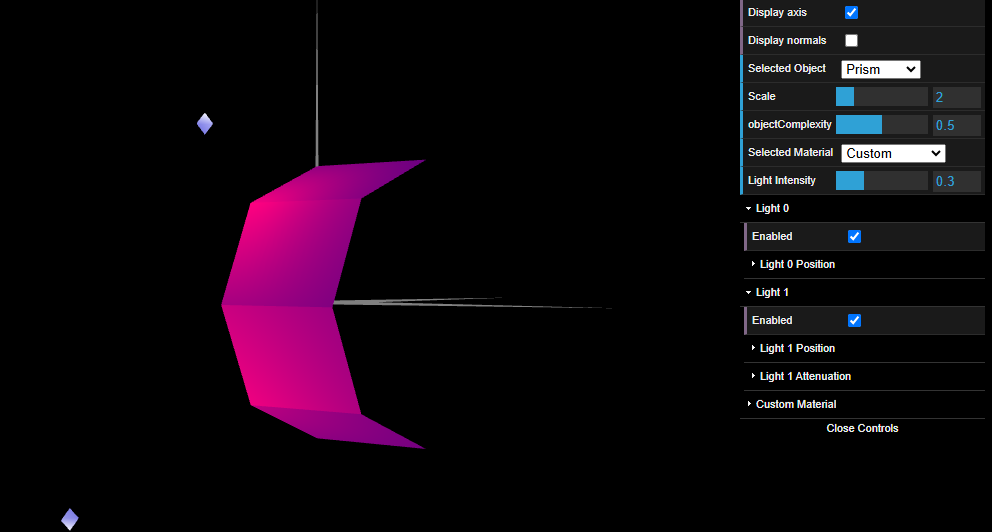

# CG 2024/2025

## Group T11G09

## TP 3 Notes

- In Exercise 1 the goal was to understand how the illumination and material properties work in WebGL. We've used the Unit Cube and Tangram from the previous exercises and applied different materials and light sources to them. First we declared the normal vectors for these objects and then we created a new material similar to the wood color and tested it on the Unit Cube (Figure 1). Then we painted each piece of the Tangram with the corresponding color of the image provided in the exercise (Figure 2).

Figure 1: Unit Cube

Figure 2: Tangram

- In Exercise 2 we started by implementing an algorithm to draw a prism with variable faces and then extended it to variable partitions. The illumination is very similar to constant shading because the normals are the same for the same face.

Figure 3: Prism

- Exercise 3...