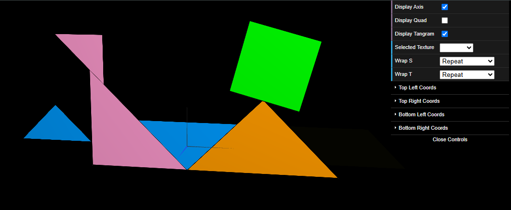

# CG 2024/2025

## Group T11G09

## TP 4 Notes

- In exercise 1 we defined a new texture, "tangram.png", and then applied it to each piece of the tangram. The hardest part was understanding how to define the texture and which points of the texture we needed at each vertex.

Figure 1: Tangram textured

- In exercise 2 we used the MyUnitCubeQuad class that was implemented in TP2 to apply a texture to each side of the cube using the three images that were given (one for the top, other for the bottom, and other for the sides).

Figure 2: Unit Cube before linear filtering

- As we can see, the textures were poorly defined due to the fact that they were originally 16x16 pixels but the unit cube faces were a lot bigger. To solve this problem we applied the given function that was commented
to apply a *linear filtering* to each face of the cube. 

Figure 2: Unit Cube after linear filtering
