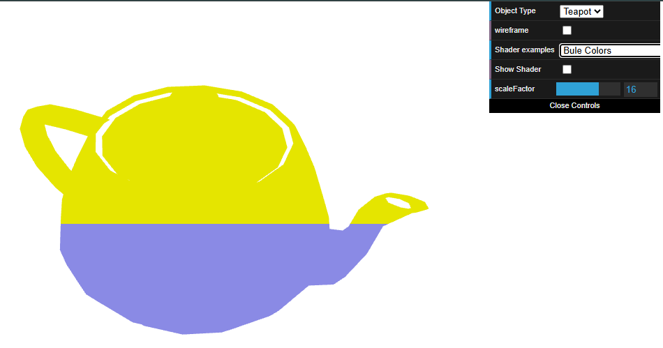
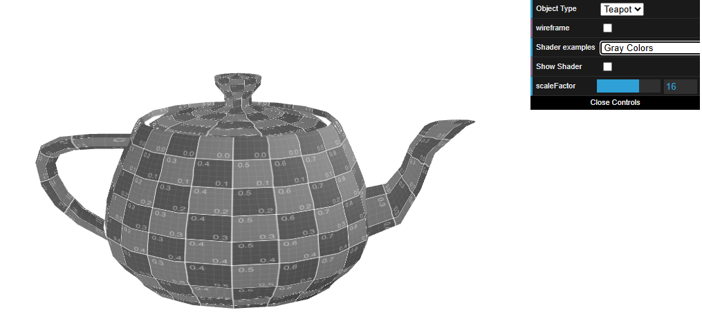
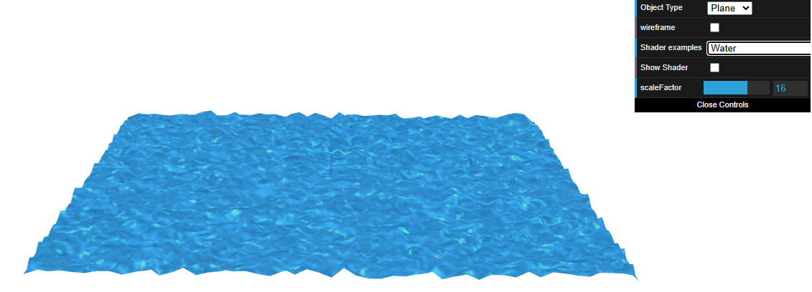

# CG 2024/2025

## Group T11G09

## TP 5 Notes

- In Exercise 1, we created new Vertex and Fragment shaders, which allowed us to paint the top of Bule with yellow and the bottom with blue.

Figure 1: Bule Yellow and Blue/p>

- Also in Exercise 1, we created a gray shader very similiar to sepia.

 Figure 2:Gray Bull /p>

- In Exercise 2, we applied the water texture to the shaders. We also animated the texture coordinates through time and the vertices through the color of the texture components.

 Figure 2:Water Animation /p>